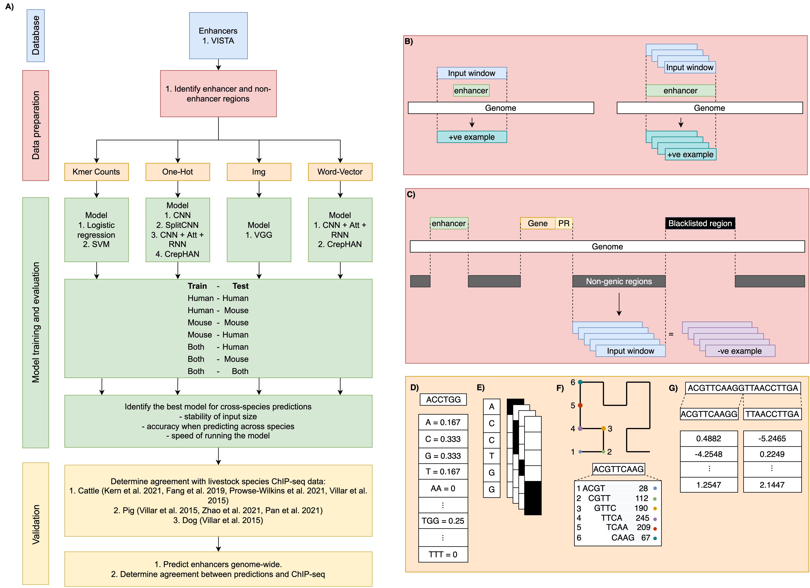

# Cross-species-enhancer-prediction
Repo for code relating to our cross-species enhancer predicition work. Insert citation

## Methods Overview

## Training Data
Code relating to generating the training data from VISTA can be found in these notebooks.
- Processing VISTA fasta file into ML data. [Process VISTA](data_process_Vista.ipynb)
- Convert fasta to one-hot encoding. [seq2one-hot](fasta_process_Seq2onehot.ipynb)
- Convert fasta to image. [Seq2Img](fasta_process_DNA2Img.ipynb)
- Convert fasta to word-vector. [Seq2Word-vector](fasta_process_word_vector.ipynb)

## Model Training
Code relating to training the models from the VISTA data can be found in these notebook.

## Model Permutations
Code relating to model permutations can be found here:
- [Permute model](clean_permutations.ipynb)

